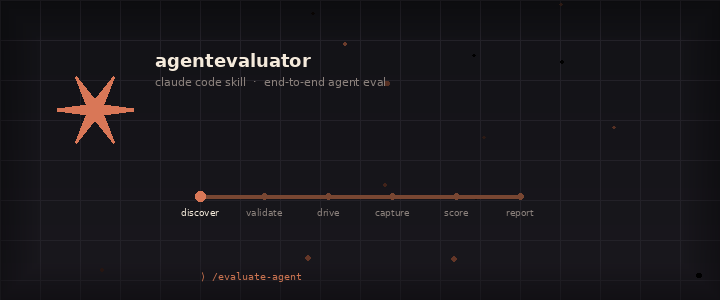
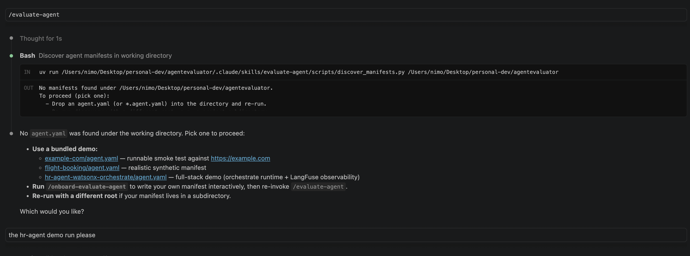
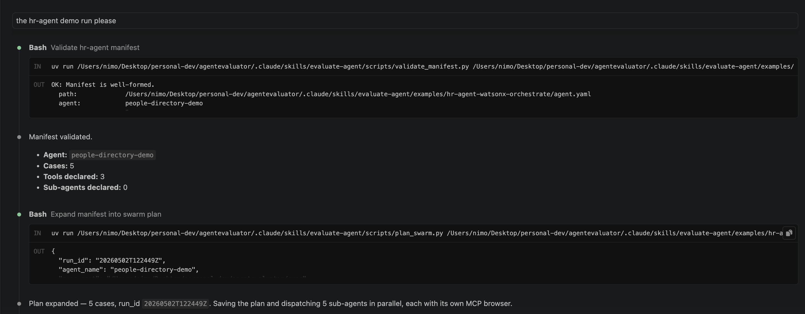
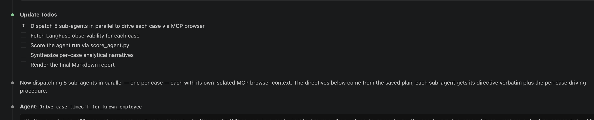
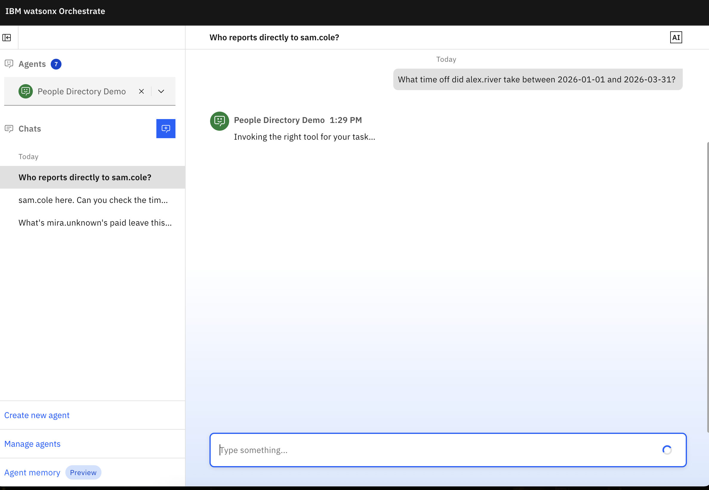

<div align="center">

<br>



<br><br>

**A [Claude Skill](https://support.claude.com/en/articles/12512176-what-are-skills) that interrogates your deployed agent so you don't have to 🔬**

<p align="center">
  
</p>

---

</div>

<br>

## How to run this skill on an agent deployed on any agent runtime:

#### Step 1: Clone this repository

#### Step 2: Set-up [Claude Code](https://code.claude.com/docs/en/vs-code) on VSC

#### Step 3: 

```
> /onboard-evaluate-agent          ← answer a few questions, get an agent.yaml manifest, this describes the configuration for the eval run including the conversation trajectories that will/should be tested.
> /evaluate-agent                  ← sit back. claude does the rest.
```

## Quick Run using IBM's ADK. [*IBM ADK?*](https://developer.watson-orchestrate.ibm.com)

The repo ships with a ready-to-run example so you can see the full loop before wiring up your own agent:

- **[`hr-agent-watsonx-orchestrate`](.claude/skills/evaluate-agent/examples/hr-agent-watsonx-orchestrate/agent.yaml)**
→ Check the [walkthrough](.claude/skills/evaluate-agent/examples/hr-agent-watsonx-orchestrate/_resources/README.md) to see how it all connects.

#### 🧐 Enable orchestrate's built-in Langfuse

Orchestrate's Developer Edition ships with Langfuse built in but it's opt-in — start the server with the flag below so the trace-backend-only assertions (`max_total_tokens`, `max_total_cost_usd`, `max_latency_ms`, on top of the four UI-introspectable ones — `must_call`, `must_not_call`, `must_route_to`, `max_steps`) resolve to passed/failed instead of inconclusive:

```sh
orchestrate server start --with-langfuse        # -l also works
```

Local Langfuse UI lands at [`http://localhost:3010`](http://localhost:3010) (creds: `orchestrate@ibm.com` / `orchestrate`). Sign in, generate an API key pair (Settings → API Keys), export them as `LANGFUSE_PUBLIC_KEY` / `LANGFUSE_SECRET_KEY` in the shell that runs `/evaluate-agent`. Tool-call / agent-decision / generation spans are auto-emitted by orchestrate — no SDK wiring lives in your tools. The fetcher pulls `usage` (input / output / total tokens), `cost_details` (USD), and `start_time` / `end_time` (latency) off every GENERATION observation and lands them in `generations.jsonl`, so the three generation-grounded assertions become evaluable. The bundled [`hr-agent-watsonx-orchestrate/agent.yaml`](.claude/skills/evaluate-agent/examples/hr-agent-watsonx-orchestrate/agent.yaml) declares calibrated `max_total_tokens` / `max_total_cost_usd` / `max_latency_ms` bounds on every case — running the demo with LangFuse enabled captures token usage, cost, and per-case wall-clock as pass/fail signal alongside the behavioural assertions.

#### Use OpenTelemetry instead of LangFuse with `observability.otel`

For agents already emitting OpenTelemetry GenAI semantic-convention spans to a Tempo-style query backend, declare `observability.otel` in place of `observability.langfuse` (the two are mutually exclusive — declaring both is rejected). The fetcher hits `<endpoint>/api/search?tags=session.id=<case>` for matching trace ids and `<endpoint>/api/traces/<id>` for each trace's resourceSpans, then maps GenAI semconv attributes (`gen_ai.operation.name`, `gen_ai.tool.name`, `gen_ai.agent.name`, `gen_ai.usage.*`, `gen_ai.request.model`) onto the same canonical schema LangFuse traces produce — same on-disk JSONL, same scoring path, same assertion coverage:

```yaml
observability:
  otel:
    endpoint: https://tempo.example.com
    headers_env: OTEL_EXPORTER_OTLP_HEADERS   # optional; OTLP "key=value,key2=value2" format
```

Backends that don't natively expose Tempo's `/api/search` + `/api/traces/<id>` shape (Jaeger, Zipkin, Phoenix, etc.) front the fetcher through a Tempo-compatible shim. `/onboard-evaluate-agent` asks for endpoint + headers env one turn at a time during Step 7a.

#### ⏩ Skip a trace backend entirely with `observability.ui_introspection`

> The motivation for this feature is to provide a bare-bones mechanism for performing eval in opaque runtimes and scenarios where an agent is expected
> to render clickable widgets while resolving user queries, at a bare minimum - this feature offers basic integration testing

When the chat UI itself surfaces tool calls + parameters (Orchestrate's reasoning panel, LangSmith Studio's run pane, AutoGen Studio's debug drawer, your own debug element), declare `observability.ui_introspection` and the evaluator extracts the same structured evidence directly from the captured post-submit DOM — same on-disk JSONL, same scoring path, no separate trace backend required (of-course, with a limited view of final metrics - <ins>suited for basic higher-level eval insights: integration tests, tool use, user query resolution success, etc.</ins>):

```yaml
observability:
  ui_introspection:
    description: >
      Each agent reply renders a 'reasoning' panel; clicking the toggle
      expands it inline within the same agent-reply DOM subtree, listing
      tool name + JSON arguments + result per step in execution order.
    reveal_actions:
      - action: click
        selector: "button[aria-label='Show reasoning']"
    exposes:
      - tool_calls
      - routing_decisions
```

`/onboard-evaluate-agent` asks whether your chat UI surfaces this signal during onboarding and walks you through `description`, `reveal_actions`, and `exposes` one turn at a time. The trace backend (LangFuse OR OTEL) and `ui_introspection` can coexist on the same manifest — when both are declared, the trace fetch wins and UI extraction acts as the fallback. See [`examples/hr-agent-watsonx-orchestrate/agent.yaml`](.claude/skills/evaluate-agent/examples/hr-agent-watsonx-orchestrate/agent.yaml) for the full shape against the Orchestrate UI.

#### Happy-path testing/POC

 *ran against the onboarding manifest [here](.claude/skills/evaluate-agent/examples/hr-agent-watsonx-orchestrate/agent.yaml)*

<br>

 *exhaustive pre-flight check-list so validation errors/env misconfigurations are caught early*
 *claude orchestrates an agent swarm to execute different workflows/testing scenarios live on the deployed agent in parallel*

<br>

 *for IBM Orchestrate-lite, this means using playwright to interact with the deployed agent through the ADK built-in Orchestrate ChatUI for basic eval metrics, and/or optionally using its trace emitting backend for deeper insights (recommended approach for eval, playwright is sensory and relevant for automating workflows with clickable widgets/live integration testing)*

<br>

## CI integration 📜

Every script under [`.claude/skills/evaluate-agent/scripts/`](.claude/skills/evaluate-agent/scripts/) (`validate_manifest`, `discover_manifests`, `plan_swarm`, `score_case`, `score_agent`, `render_report`, `fetch_observability`, `validate_narrative`) accepts the same two CI-oriented flags:

```sh
--log-format {text,json}    # diagnostic logs on stderr (default: text)
--metrics PATH              # JSON timing document written to PATH at completion
```

`--log-format json` emits one JSON object per log record on stderr with `timestamp`, `level`, `logger`, `message`, plus contextual fields (`run_id`, `case_id`, `assertion_kind`, `manifest_path`, `case_dir`) when bound — pipe straight into your log aggregator. `--metrics PATH` writes a `ScriptMetrics` JSON document to PATH on both success and error paths, recording per-phase wall-clock timing, the script's `exit_status`, and the bound context. Stdout primary output (success blocks, JSON records, Markdown reports) is unaffected, so `score_agent.py | render_report.py /dev/stdin` still composes.

```sh
score_agent.py plan.json --metrics runs/myagent/20260502T120000Z/score.metrics.json > score.json
render_report.py score.json --metrics runs/myagent/20260502T120000Z/render.metrics.json > report.md
```

## Regression detection against a baseline 📉

`score_agent.py` and `render_report.py` accept `--baseline PATH` pointing at a prior `AgentScore` JSON for the same agent. The diff pairs every assertion across runs by `(case_id, assertion_kind, target)` and categorizes each transition as `newly_failing`, `newly_inconclusive`, `newly_passing`, `unchanged`, `introduced`, or `removed`.

```sh
# Score the new run against last week's baseline; the AgentScore output
# carries an embedded baseline_diff field for downstream consumers.
score_agent.py plan.json --baseline runs/myagent/20260425T120000Z/score.json > score.json

# Render the report with a Diff vs baseline section.
render_report.py score.json --baseline runs/myagent/20260425T120000Z/score.json > report.md
```

A baseline whose `agent_name` does not match the current run is rejected with an actionable error. Pipe `--metrics PATH` alongside to track diff-computation cost across runs.

<br>

<div align="center">

---

<sub> UNDER CONSTRUCTION 🚧 · Powered by stubbornness and too much coffee ☕️</sub>

<p align="center">
  
</p>

<br>

#### On the workbench 🛠️

| | Feature | What it brings |
| :---: | :--- | :--- |
| 🔧 | Citation grounding | Narrative claims must cite an artifact whose contents actually contain the claimed evidence — not just a path that exists on disk. |
| 🔧 | Reply-region scoping | `final_response_contains` matches only inside the agent's most recent reply via an explicit `interaction.reply_selector`, not anywhere in the captured DOM. |
| 🔧 | Real orchestrator | Swarm dispatch moves from prose-in-SKILL.md into `evaluate_agent.dispatch` — slot pinning, retries, idempotent re-runs, and per-host concurrency caps in code. |
| 🔧 | Flake detection | `--repeat N` drives every case N times into sibling runs and `--aggregate-runs` flags assertions whose pass rate falls below a stability threshold. |
| 🔧 | Multi-turn conversations | `Case.turns` lets a case carry an ordered conversation with per-turn assertions, evaluated against each turn's reply region. |

</div>
